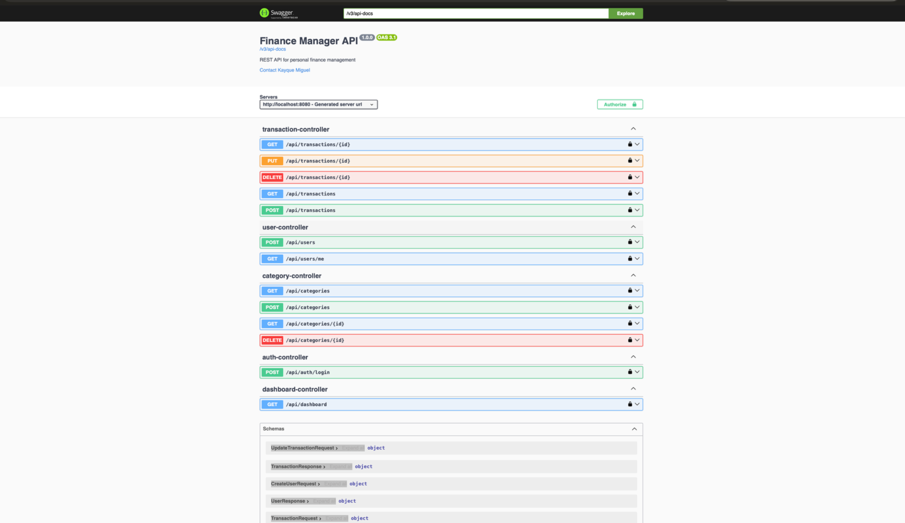
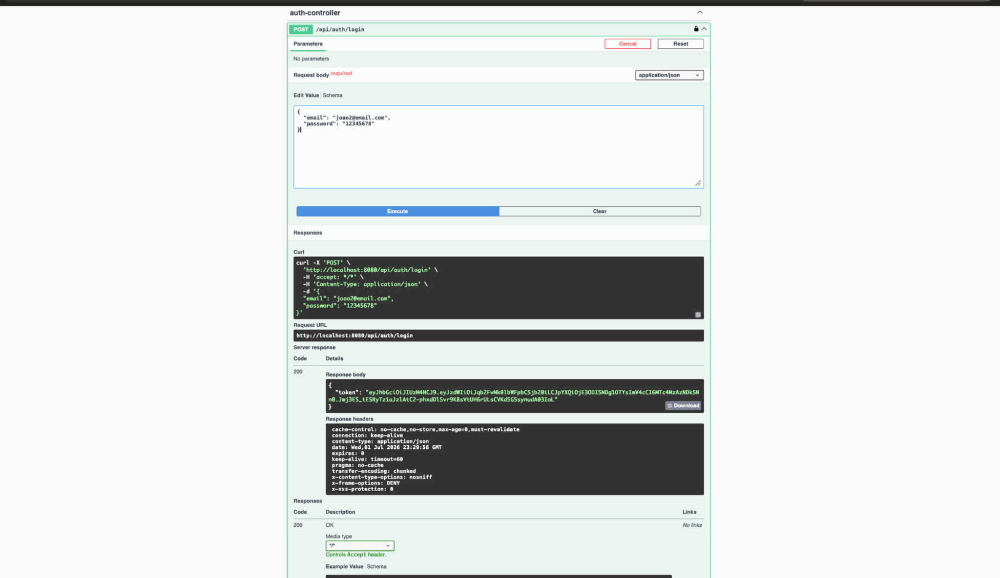
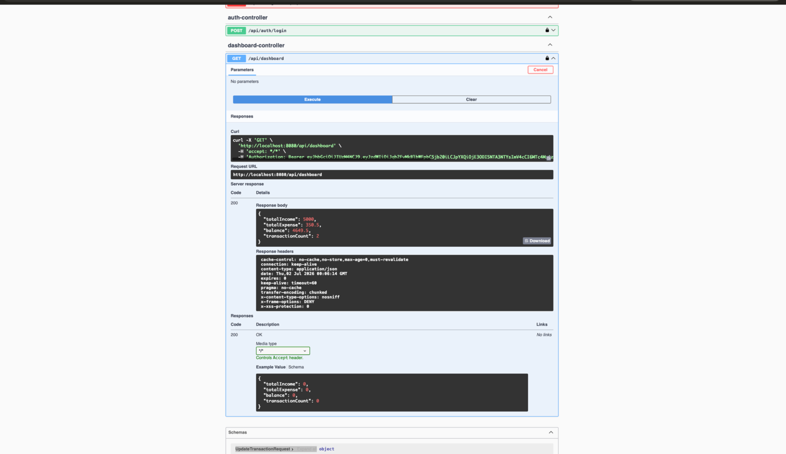
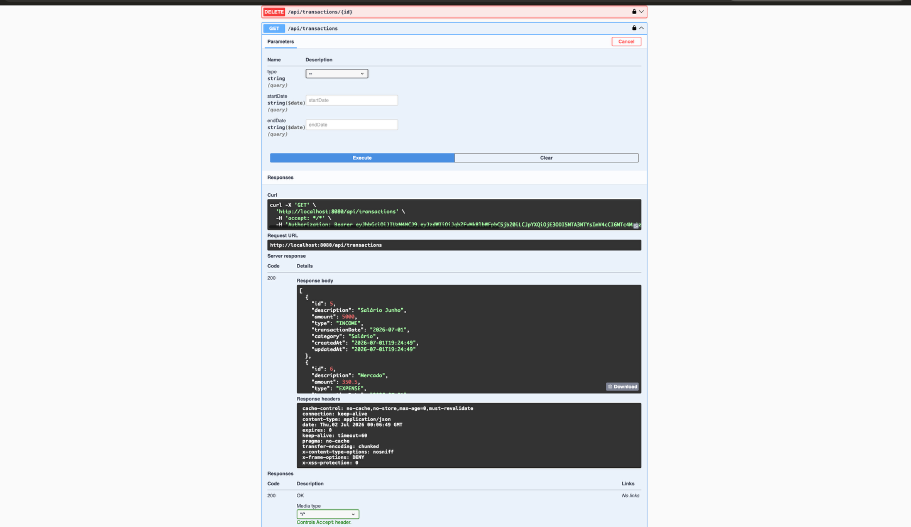
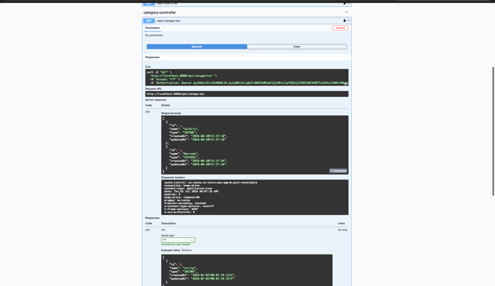

# 💰 Finance Manager API

<p align="center">
  
  
  
  
  
  
</p>

---

##  About

Finance Manager API is a RESTful backend application developed with **Java 21** and **Spring Boot** for personal finance management.

The system allows authenticated users to register incomes and expenses, organize transactions by category, monitor financial summaries through a dashboard, and securely access their own data using JWT authentication.

This project was developed to demonstrate backend development skills using modern Java technologies and REST API best practices.

---

##  Features

- ✅ JWT Authentication
- ✅ User Registration
- ✅ Secure Password Encryption (BCrypt)
- ✅ CRUD for Transactions
- ✅ CRUD for Categories
- ✅ Financial Dashboard
- ✅ Income & Expense Management
- ✅ Transaction Filtering by Type
- ✅ Transaction Filtering by Date Range
- ✅ Exception Handling
- ✅ RESTful API
- ✅ Swagger Documentation

---

# Tech Stack

| Technology | Version |
|------------|---------|
| Java | 21 |
| Spring Boot | 3.x |
| Spring Security | ✓ |
| Spring Data JPA | ✓ |
| Hibernate | ✓ |
| MySQL | 8 |
| JWT | ✓ |
| Lombok | ✓ |
| Maven | ✓ |
| Swagger OpenAPI | ✓ |

---

# Project Structure

```
src
 ├── config
 ├── controller
 ├── dto
 ├── entity
 ├── exception
 ├── mapper
 ├── repository
 ├── security
 └── service
```

The project follows a layered architecture separating business rules, persistence, security, and API communication.

---

# Authentication

The API uses **JWT (JSON Web Token)** authentication.

Workflow:

```
Register User
      ↓
Login
      ↓
Receive JWT Token
      ↓
Authorize on Swagger
      ↓
Access Protected Endpoints
```

---

# Available Endpoints

## Authentication

| Method | Endpoint |
|---------|-----------|
| POST | /api/auth/login |

---

## Users

| Method | Endpoint |
|---------|-----------|
| POST | /api/users |
| GET | /api/users/me |

---

## Categories

| Method | Endpoint |
|---------|-----------|
| GET | /api/categories |
| POST | /api/categories |
| GET | /api/categories/{id} |
| DELETE | /api/categories/{id} |

---

## Transactions

| Method | Endpoint |
|---------|-----------|
| GET | /api/transactions |
| GET | /api/transactions/{id} |
| POST | /api/transactions |
| PUT | /api/transactions/{id} |
| DELETE | /api/transactions/{id} |

Supports:

- Filter by Transaction Type
- Filter by Date Range

---

## Dashboard

| Method | Endpoint |
|---------|-----------|
| GET | /api/dashboard |

Returns:

- Total Income
- Total Expenses
- Current Balance
- Transaction Count

---

# API Preview

## Swagger Documentation



---

## Authentication



---

## Dashboard



---

## Transactions



---

## Categories



---

# Running the Project

## Clone repository

```bash
git clone https://github.com/kayquemigueldev/finance-manager.git
```

Enter the project

```bash
cd finance-manager
```

Configure MySQL database

Update:

```
application.properties
```

Run

```bash
./mvnw spring-boot:run
```

Swagger:

```
http://localhost:8080/swagger-ui/index.html
```

---

# Future Improvements

- Pagination
- Sorting
- Docker Support
- Unit Tests
- Integration Tests
- Refresh Token
- User Roles (Admin/User)
- Financial Reports
- CSV Export
- PDF Export

---

# Author

**Kayque Miguel da Fonseca Reis Galvão**

GitHub:

https://github.com/kayquemigueldev

---

⭐ If you enjoyed this project, consider giving it a star!